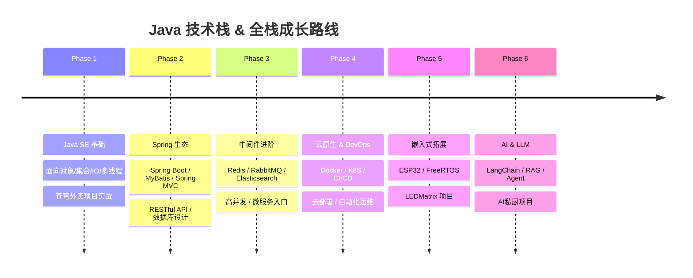

<p align="center">
  
</p>

<p align="center">
  <a href="https://whaleink.top" target="_blank">
    
  </a>
  <a href="https://github.com/MrliCST" target="_blank">
    
  </a>
  
  
</p>

<p align="center">
  
  
  
</p>

---

## 🎯 关于我 · About Me

> **「从零搭建知识体系，在代码中丈量成长。」**

我是 **MrliCST**，一名持续进阶中的后端开发者，目前深耕 **Java 技术栈**，同时游走于嵌入式与全栈边界。

| 领域 | 关键词 | 熟练度 |
|:---|:---|:---:|
| 🖥️ 后端开发 | Java · Spring Boot · MyBatis · MySQL | ⭐⭐⭐ |
| 🔌 嵌入式 | ESP32 · C++ · LEDMatrix | ⭐⭐ |
| 🧠 AI/LLM | LangChain · Python · RAG | ⭐⭐ |
| ⚙️ 操作系统 | x86 内核 · Linux | ⭐⭐ |
| 🌐 前端 | Vue · HTML/CSS/JS | ⭐⭐ |
| 🐳 DevOps | Docker · Git · CI/CD | ⭐⭐ |

---

## 🛣️ 学习路线 · Learning Roadmap



### 📅 当前阶段

```
┌─────────────────────────────────────────────────────────────┐
│  🚩 Phase 2 → Phase 3      Spring Boot + MyBatis 深度实践   │
│  🎯 目标：掌握微服务架构 + 中间件生态                       │
│  📊 进度：████████░░░░░░░  55%                              │
└─────────────────────────────────────────────────────────────┘
```

---

## ✅ 技能树 · Skill Tree

### ☕ 后端核心

| 技能 | 熟练度 | 相关项目 |
|:---|:---:|:---|
| Java | ████████░░ 80% | 苍穹外卖 |
| Spring Boot | ███████░░░ 70% | 苍穹外卖 |
| MyBatis / MyBatis-Plus | ██████░░░░ 60% | 苍穹外卖 |
| MySQL | ██████░░░░ 60% | 苍穹外卖 |
| Redis | ████░░░░░░ 40% | 学习中 |
| Spring Cloud | ██░░░░░░░░ 20% | 即将开始 |

### 🔧 嵌入式 & 系统

| 技能 | 熟练度 | 相关项目 |
|:---|:---:|:---|
| C / C++ | ██████░░░░ 60% | LEDMatrix · linux00 |
| ESP32 / Arduino | ██████░░░░ 60% | LEDMatrix |
| x86 汇编 / 操作系统 | ████░░░░░░ 40% | linux00 |
| Linux 系统编程 | ███████░░░ 70% | linux00 |

### 🐍 AI & Python

| 技能 | 熟练度 | 相关项目 |
|:---|:---:|:---|
| Python | ██████░░░░ 60% | AI私厨 · ragent |
| LangChain / LLM | ██████░░░░ 60% | AI私厨 |
| RAG / Agent | ████░░░░░░ 40% | ragent |

### 🌐 前端 & DevOps

| 技能 | 熟练度 | 相关项目 |
|:---|:---:|:---|
| Vue.js | ████░░░░░░ 40% | 个人博客 |
| HTML / CSS / JS | ██████░░░░ 60% | 个人博客 |
| Docker | ██████░░░░ 60% | 苍穹外卖部署 |
| Git / GitHub | ████████░░ 80% | 所有项目 |

---

## 📂 项目索引 · Project Portfolio

| 项目 | 技术栈 | 简介 | 🔗 |
|:---|:---|:---|:---:|
| 🍽️ **苍穹外卖** | Java · Spring Boot · MyBatis · MySQL | 企业级外卖系统后端 | [→ 查看](https://github.com/MrliCST) |
| 🤖 **AI私厨** | Python · LangChain · LLM · OpenAI | AI 驱动的智能菜谱助手 | [→ 查看](https://github.com/MrliCST/persional_cheif) |
| 🖥️ **linux00** | C · x86 · OS Kernel | 从零实现 x86 操作系统内核 | [→ 查看](https://github.com/MrliCST/linux00) |
| 💡 **LEDMatrix** | C++ · ESP32 · Arduino | 嵌入式 LED 点阵屏驱动 | [→ 查看](https://github.com/MrliCST/LEDMatrix) |
| 🔍 **RAGent** | Python · RAG · LLM · Agent | 基于 RAG 的智能问答 Agent | [→ 查看](https://github.com/MrliCST/ragent) |
| 🧠 **PostureDetector** | Python · CV · ML | 姿态检测 AI 应用 | [→ 查看](https://github.com/MrliCST/posture-detector) |

---

## 📝 博客文章 · Blog Posts

> 🌊 **技术博客**: [whaleink.top](https://whaleink.top)

精选文章索引（来自我的个人博客）：

| 文章 | 分类 | 📅 |
|:---|:---|:---:|
| *Spring Boot 项目从 0 到 1* | ☕ Java | 近期 |
| *MyBatis 踩坑记* | ☕ Java | 近期 |
| *ESP32 LED 矩阵驱动实战* | 🔌 嵌入式 | 近期 |
| *从零开始写 x86 内核* | ⚙️ OS | 近期 |
| *LangChain + 私厨菜谱：AI 项目实践* | 🤖 AI | 近期 |

> 💡 *更多内容持续更新中，欢迎访问我的博客交流~*

---

## 🎯 当前学习目标 · Current Goals

- [ ] **Spring Cloud 微服务** — 完成苍穹外卖微服务重构
- [ ] **Redis 深度掌握** — 缓存、分布式锁、秒杀场景实战
- [ ] **RabbitMQ** — 消息队列异步通信实践
- [ ] **Docker 高级部署** — 多容器编排 + Docker Compose
- [ ] **Elasticsearch** — 全文搜索入门与整合
- [ ] **博客系统升级** — 前后端分离 + 更多技术文章输出
- [ ] **操作系统内核完善** — 添加中断、内存管理等模块

---

## 📊 GitHub 统计

<p align="center">
  
  
</p>

<p align="center">
  
</p>

---

## 📬 联系我 · Get in Touch

<p align="center">
  <a href="https://whaleink.top" target="_blank"></a>
  <a href="https://github.com/MrliCST" target="_blank"></a>
  
  
</p>

---

<p align="center">
  
</p>
